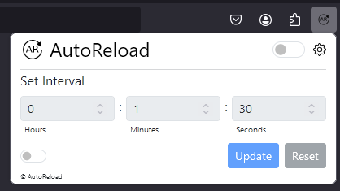

# AutoReload Extension

AutoReload Firefox extension, built to enable the ability to reload browser tabs automatically after a specified interval. Idle timeout support. Built in typescript using react, webpack, bootstrap, and browser runtime API.

## Dependencies

- Node 19.x https://nodejs.org/en/download
- Yarn
- Firefox
- Linux/Windows WSL/Mac OSX supported

## Local Setup

### Install

`yarn install`

### Development

Using webpack dev server and the watch command, the popup is served to the browser for some development. Files are watched and the page will reload when saved.

`yarn run dev`

### Build App

`yarn run build`

Which creates `dist/app.js` which is the entrypoint (background) and `dist/popup.js`

### Build Signed App

- Install `direnv`
- Create an `.envrc` file from `.envrc.example` in the root
- Enter the app credentials in the `.envrc` file
- Optionally run `direnv allow` in the root directory if you didn't install the recommended direnv extension
- Update the version in `manifest.json`
- Run `yarn run build-signed`
- A new `.xpi` file should be created in `./release` if successful

## Docker Setup (optional)

- Install docker
- Build the container using `docker-compose build`

### Dev environment through docker

`docker-compose up`

### Build with docker

Builds temporary extension in the `./dist`` folder

- Run `docker-compose -f docker-compose.yml -f docker-compose.build.yml up --build`

# Testing in Firefox

Go to `about:debugging#/runtime/this-firefox` and the select 'Load Temporary Add-on' and the select manifest.json in the `dist` directory.

# Resources

- https://extensionworkshop.com/documentation/develop/web-ext-command-reference/#global-options
- https://extensionworkshop.com/documentation/develop/getting-started-with-web-ext/#using-web-ext-section
